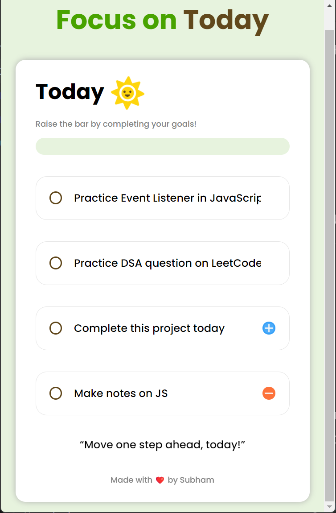
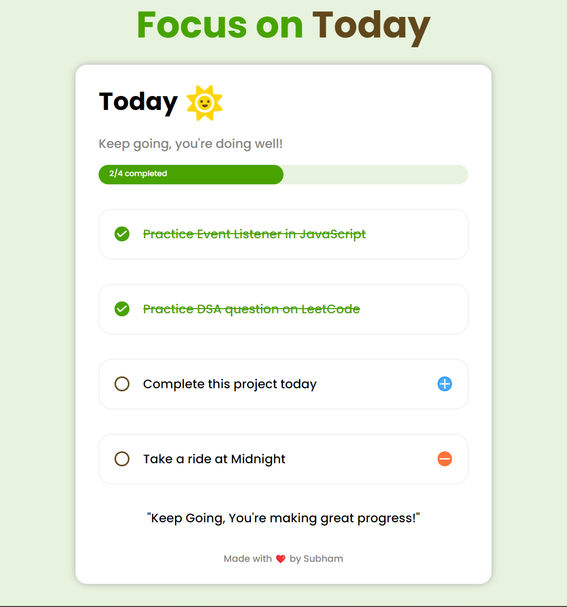

# Focus on Today

Focus on Today is a simple web application designed to help users stay organized and focused.

## Features

- **Goal Setting:** Set up to 3 goals for the day.
- **Goal Tracking:** Mark goals as completed throughout the day.
- **User-Friendly Interface:** Intuitive design for seamless goal scheduling and task management.

## Usage

1. **Goal Setting:**
   - Click on the "Add new goal..." placeholder under each goal container.
   - Enter your goal for the day.
   - Press Enter or click outside the input field to save the goal.

2. **Goal Tracking:**
   - Click on the checkbox next to each goal to mark it as completed.
   - Completed goals will have a tick mark icon.

3. **Error Handling:**
   - If you try to proceed without setting at least 3 goals, an error message will appear prompting you to set all 3 goals.

## Credits

- **Designed & Inspiration:** Anurag Singh (https://github.com/procodrr)
- **Fonts:** Poppins

## License

This project is licensed under the MIT License. See the LICENSE file for details.

